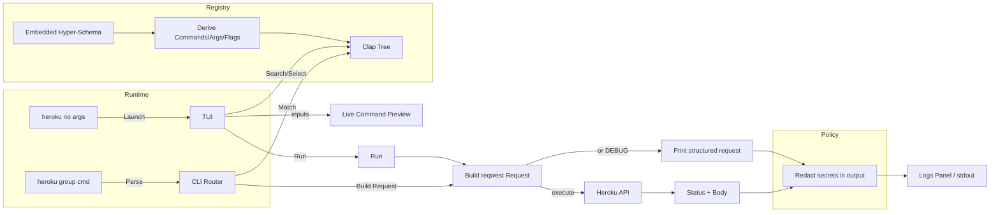

# Heroku CLI (Rust, Experimental)

A schema-driven Heroku CLI with both non-interactive and interactive TUI modes. Commands, arguments, and flags are derived from a pre-built manifest generated at build time from the Heroku JSON Hyper-Schema.

## Features
- Dynamic command registry from a generated manifest (no static command tables at runtime).
- CLI and TUI supported:
  - TUI: modern dark theme, search + auto-scrolling command list, inputs with validation, enum cycling, boolean toggles, live Command preview, logs.
- Auth precedence: `HEROKU_API_KEY` > `~/.netrc` (basic parser).
- Redaction: Authorization and secret-like values are masked in output.

## Usage
- Build: `cd heroku && cargo build --workspace`
- Run TUI (no args): `cd heroku && cargo run -p heroku-cli`
- CLI examples:
  - `cargo run -p heroku-cli -- apps list `
  - `cargo run -p heroku-cli -- apps info my-app `
  - `cargo run -p heroku-cli -- apps create --name demo `
  - `cargo run -p heroku-cli -- releases list my-app `

### TUI Controls
- Search: type to filter (Esc clears); cursor indicates where typing goes.
- Commands: Up/Down selects; auto-scroll keeps selection visible; Enter focuses Inputs.
- Inputs: required args first, then flags; cursor and subtle highlight mark the active field.
  - Booleans: Space toggles [ ]/[x].
  - Enums: Left/Right cycles allowed values; defaults applied from schema.
- Run: Enter; Help: Ctrl+H; Tab/Shift-Tab cycles focus; Quit: Ctrl+C.
  - Copy command to clipboard: Ctrl+Y.

## Architecture
- Registry (manifest → commands): at build time, the schema is converted into a compact JSON manifest; at runtime, the registry deserializes this manifest to expose commands (e.g., `apps:list`, `users:apps:list`).
- CLI: loads registry and builds Clap tree; parses inputs; builds and sends requests (or ``).
- TUI: Ratatui + Crossterm; state (app.rs), rendering (ui.rs), CLI preview (preview.rs), theme (ui/theme).
- API: minimal reqwest client with headers, timeouts, and auth precedence.
- Util: redaction helpers.

## Environment
- `HEROKU_API_KEY`: Bearer token for Heroku API (preferred over `~/.netrc`).
- `DEBUG`: when truthy (non-empty, not `0`/`false`)
- `RUST_LOG`: set to `info`/`debug` to see logs.

## Development
- Workspace: `cli`, `tui`, `registry`, `engine`, `api`, `util`, `registry-gen`.
- Build all: `cargo build --workspace` (generates and embeds the manifest)
- Test all: `cargo test --workspace`
- Lint: `cargo clippy --workspace -- -D warnings`
- Format: `cargo fmt --all`
### Build-time manifest
- Source schema: `schemas/heroku-schema.json`
- Generator crate: `crates/registry-gen` (library + bin)
- Build script: `crates/registry/build.rs` writes `OUT_DIR/heroku-manifest.json`

## Registry Generator (Library + CLI)

The registry is derived from the Heroku JSON Hyper-Schema using the `registry-gen` crate. You can use it both as a standalone CLI and as a Rust library.

### CLI Usage

- Binary (bincode) manifest:

```
cargo run -p heroku-registry-gen -- schemas/heroku-schema.json target/manifest.bin
```

- JSON manifest with `--json` flag:

```
cargo run -p heroku-registry-gen -- --json schemas/heroku-schema.json target/manifest.json
```

Notes:
- The CLI creates parent directories for the output path if needed.
- By default, it writes a compact bincode file for fast loading.

### Library Usage

Add a dependency on the generator crate from within the workspace:

```toml
[dependencies]
heroku-registry-gen = { path = "crates/registry-gen" }
```

Generate a manifest file (bincode):

```rust
use std::path::PathBuf;
use heroku_registry_gen::write_manifest;

fn main() -> anyhow::Result<()> {
    let input = PathBuf::from("schemas/heroku-schema.json");
    let output = PathBuf::from("target/manifest.bin");
    write_manifest(input, output)?;
    Ok(())
}
```

Generate a manifest file (JSON):

```rust
use std::path::PathBuf;
use heroku_registry_gen::write_manifest_json;

fn main() -> anyhow::Result<()> {
    let input = PathBuf::from("schemas/heroku-schema.json");
    let output = PathBuf::from("target/manifest.json");
    write_manifest_json(input, output)?;
    Ok(())
}
```

Derive commands in-memory from a schema string:

```rust
use heroku_registry_gen::generate_commands;

fn load_commands(schema_json: &str) -> anyhow::Result<Vec<heroku_types::CommandSpec>> {
    let cmds = generate_commands(schema_json)?;
    Ok(cmds)
}
```


## Flow



## Security
- Secrets are redacted from output by default (headers/payload in output and logs).
- Network calls go through reqwest with default timeouts.

## Status
- Schema-driven registry, CLI router, and TUI are implemented. Engine (workflows) is a placeholder. Some HTTP client behaviors (retries/backoff) are minimal.

## Theme Architecture
- Location: `crates/tui/src/ui/theme` (roles, helpers, Dracula/Nord themes)
- Docs: `plans/THEME.md` (Dracula mapping, usage, and guidelines)
- Select theme via env var `TUI_THEME`:
  - `dracula` (default), `dracula_hc`
  - `nord`, `nord_hc`
  - Example: `TUI_THEME=dracula cargo run -p heroku-cli`
