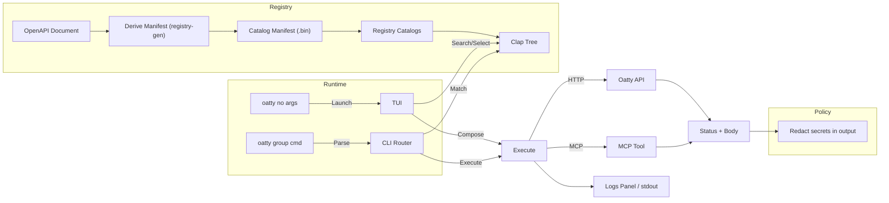

[](https://github.com/oattyio/oatty/actions/workflows/ci.yml)


# Oatty - Schema-driven CLI + TUI + MCP

A vendor-agnostic operations surface for teams that are tired of juggling near-identical CLIs, partial API coverage, and
separate MCP servers with different constraints.

Oatty turns OpenAPI documents into runnable commands, lets you execute them from one consistent CLI/TUI, and extends
that surface with MCP tools and reusable workflows.

## Why Oatty Exists

Modern developer tooling has a strange paradox:  
the APIs are powerful and well-documented, but the tools built on top of them are fragmented, incomplete, and
inconsistent.

Most vendor CLIs are thin wrappers around an API with a small set of hand-crafted workflows.  
When you work across vendors, the experience converges into the same problems:

- Nearly identical commands with different naming conventions
- Partial API coverage that forces you back to curl or custom scripts
- Separate MCP servers that expose even *less* functionality than the CLI
- Automation that lives in brittle scripts instead of reusable, inspectable workflows

Oatty was built to collapse this complexity into **one coherent operational surface**.

---

## Core UX Principles

Oatty is not just a CLI replacement — it is a **carefully designed terminal experience** built around four core
principles.

### 1. Discoverability

You should never need to memorize commands.

- Every command, workflow, and option is searchable and browsable.
- The TUI acts as a living catalog derived directly from schemas and plugins.
- If the API supports it, you can *find it* — even if you’ve never used it before.

This makes Oatty approachable for new users and powerful for experts.

---

### 2. Simplicity

Each screen does **one thing**, clearly.

- Search commands
- Inspect details
- Run an action
- Monitor progress or results

There is no clutter, no overloaded views, and no hidden modes.  
Familiar interaction patterns (lists, tables, forms, logs) keep cognitive load low, even when the underlying task is
complex.

---

### 3. Speed

Oatty is designed for real work, not demos.

- Fast startup and low-latency interactions
- Keyboard-first navigation with the mouse interactions you'd expect from a beautiful terminal UI
- Reliable execution paths for long-running workflows and streaming output

Power users can move as fast as they can type — without sacrificing safety or clarity.

---

### 4. Consistency

Once you learn Oatty, you’ve learned every vendor's CLI, workflow, and MCP server.

- The same command model powers the CLI, the TUI, workflows, and MCP tools
- Flags, arguments, outputs, and behaviors follow consistent patterns
- Vendor-specific quirks are normalized behind a shared execution model

This consistency dramatically reduces context switching and relearning.

---

## The Big Idea

Treat vendor APIs and MCP servers as **inputs**, not product boundaries.

Oatty ingests OpenAPI schemas to build a runtime command catalog, exposes that catalog through a unified CLI and TUI,
and allows vendors or teams to extend it via MCP — all while enabling first-class, filesystem-backed workflows.

Instead of maintaining:

- N vendor CLIs
- N MCP servers
- N incompatible automation approaches

You get **one interface**, one mental model, and one place to operate.

---

## What This Unlocks

- Full API coverage without waiting for vendors to implement it their CLI
- Workflows that span multiple vendors and MCP servers
- A single MCP surface instead of fragmented plugin ecosystems
- Shareable, reviewable workflows instead of opaque scripts
- A terminal UX that scales from quick commands to complex operations

## Quick Example

Use one interface for API-derived commands and workflow execution:

```bash
# Start interactive mode
cargo run -p oatty

# Execute a command from a loaded catalog
cargo run -p oatty -- apps list

# Run a workflow from runtime storage
cargo run -p oatty -- workflow list
```

## Usage

- Build: `cargo build --workspace`
- Run TUI (no args): `cargo run -p oatty` (or the installed binary `oatty`)
- CLI examples:
    - `cargo run -p oatty -- apps list`
    - `cargo run -p oatty -- apps info my-app`
    - `cargo run -p oatty -- workflow list`
    - `cargo run -p oatty -- workflow preview --file workflows/create_app_and_db.yaml`

Note: available commands depend on which registry catalogs and MCP plugins are configured/enabled.

### First-time: import a registry catalog

If you have no catalogs configured yet, the fastest way to get started is via the TUI:

1. Run `cargo run -p oatty`.
2. In the Library view, import a local OpenAPI document (e.g., `schemas/samples/render-public-api.json`) or a URL.
3. Accept the default command prefix (or enter your own).
4. The registry configuration is saved to `~/.config/oatty/registry.json` and manifests are stored under
   `~/.config/oatty/catalogs/`.

## Architecture (high level)

- **Registry** (`crates/registry`): loads registry catalogs from `~/.config/oatty/registry.json` and reads per-catalog
  manifest files (typically `~/.config/oatty/catalogs/*.bin`).
- **MCP** (`crates/mcp`): loads `~/.config/oatty/mcp.json`, manages plugin lifecycles, and can inject MCP tool commands
  into the registry at runtime.
- **CLI** (`crates/cli`): builds a Clap tree from the registry, routes `workflow` commands, and executes HTTP/MCP
  commands.
- **TUI** (`crates/tui`): interactive UI built on Ratatui/Crossterm; includes in-app help and log panes.
- **Engine** (`crates/engine`): workflow parsing and execution utilities used by `oatty workflow ...`.

## Environment & Config

- `OATTY_LOG`: tracing level for stderr logs in CLI mode (`error`, `warn`, `info` [default], `debug`, `trace`).
- `TUI_THEME`: theme override for the TUI (`dracula`, `dracula_hc`, `nord`, `nord_hc`, `cyberpunk`, `cyberpunk_hc`,
  `ansi256`, `ansi256_hc`).
- `MCP_CONFIG_PATH`: overrides MCP config path (default: `~/.config/oatty/mcp.json`).
- `REGISTRY_CONFIG_PATH`: overrides registry config path (default: `~/.config/oatty/registry.json`).
- `REGISTRY_CATALOGS_PATH`: overrides the directory where catalog manifest files are stored (default:
  `~/.config/oatty/catalogs`).
- `REGISTRY_WORKFLOWS_PATH`: overrides workflow manifest storage (default: `~/.config/oatty/workflows`).

Authentication headers/tokens are configured per catalog in the Library view (or persisted catalog configuration), not
via a global API token environment variable.

### Logging behavior

- TUI mode silences tracing output to stderr while the UI is active to prevent overlaying the terminal UI; logs are
  routed into in-app panes where applicable.
- CLI mode writes logs to stderr as usual.

## Development

- Toolchain: `rust-toolchain.toml` pins the project to Rust `stable`.
- Workspace crates: `cli`, `tui`, `registry`, `registry-gen`, `engine`, `api`, `util`, `types`, `mcp`.
- Common commands:
    - Build: `cargo build --workspace`
    - Test: `cargo test --workspace`
    - Lint: `cargo clippy --workspace -- -D warnings`
    - Format: `cargo fmt --all`

### Registry catalogs (manifests)

- Generator crate: `crates/registry-gen` (`oatty-registry-gen`) can derive a manifest from OpenAPI documents.
- At runtime, the registry reads catalog manifests from paths referenced in `~/.config/oatty/registry.json`.

## Registry Generator (Library)

The registry is derived from OpenAPI documents using the `registry-gen` crate.

### Library Usage

Add a dependency on the generator crate from within the workspace:

```toml
[dependencies]
oatty-registry-gen = { path = "crates/registry-gen" }
```

Generate a manifest file (postcard):

```rust
use std::path::PathBuf;
use oatty_registry_gen::{io::ManifestInput, write_manifest};

fn main() -> anyhow::Result<()> {
    let schema = PathBuf::from("schemas/samples/render-public-api.json");
    let output = PathBuf::from("target/manifest.bin");
    write_manifest(ManifestInput::new(Some(schema), None, None), output)?;
    Ok(())
}
```

Generate a manifest file (JSON):

```rust
use std::path::PathBuf;
use oatty_registry_gen::{io::ManifestInput, write_manifest_json};

fn main() -> anyhow::Result<()> {
    let schema = PathBuf::from("schemas/samples/render-public-api.json");
    let output = PathBuf::from("target/manifest.json");
    write_manifest_json(ManifestInput::new(Some(schema), None, None), output)?;
    Ok(())
}
```

Derive commands in-memory from an OpenAPI document:

```rust
use oatty_registry_gen::openapi::{derive_commands_from_openapi, derive_vendor_from_document};

fn load_commands(openapi_json: &str) -> anyhow::Result<Vec<oatty_types::CommandSpec>> {
    let document: serde_json::Value = serde_json::from_str(openapi_json)?;
    let vendor = derive_vendor_from_document(&document);
    let cmds = derive_commands_from_openapi(&document, &vendor)?;
    Ok(cmds)
}
```

## Flow



## Security

- Secrets are redacted from output by default (headers/payload in output and logs).
- Network calls go through reqwest with default timeouts.

## Status

- Schema-driven registry, CLI router, TUI, MCP plugin engine, and workflow support are implemented. Some HTTP client
  behaviors (retries/backoff) are minimal.

## Theme Architecture

- Location: `crates/tui/src/ui/theme` (roles, helpers, Dracula/Nord themes)
- Docs: `specs/THEME.md` (theme mapping, usage, and guidelines)
- Select theme via env var `TUI_THEME`:
    - `dracula` (default), `dracula_hc`
    - `nord`, `nord_hc`
    - `cyberpunk`, `cyberpunk_hc`
    - `ansi256`, `ansi256_hc`
    - Example: `TUI_THEME=dracula cargo run -p oatty`

## Code Signing (macOS)

To avoid repeated Keychain prompts (the CLI uses the macOS Keychain via `keyring`), sign the binary with a stable
identity. You can use a self-signed certificate for local development or a Developer ID for distribution.

- Create a self-signed identity (one-time):
    - `KEYCHAIN_PASSWORD='<login password>' scripts/macos/create-dev-cert.sh "next-gen-cli-dev (LOCAL)"`
    - The script imports both the certificate and private key, updates the keychain partition list when
      `KEYCHAIN_PASSWORD` is provided, and prints the codesign identity string.

- Build and sign the binary:
    - `cargo build -p oatty`
    - `NEXTGEN_CODESIGN_ID="<identity name>" NEXTGEN_CODESIGN_BIN=target/debug/oatty scripts/macos/sign.sh`
        - Optional variables: `NEXTGEN_ENTITLEMENTS` to override the entitlements path,
          `NEXTGEN_CODESIGN_TIMESTAMP=true|false` to force timestamping, `NEXTGEN_CODESIGN_HARDENED=false` (or comment
          the option) if you need to skip hardened runtime temporarily.

- After the first secrets access prompt, adjust Keychain Access Control to avoid future prompts:
    - Open Keychain Access → search for the item (service usually `oatty`).
    - Double-click → Access Control tab → either allow all apps signed by your certificate or add the binary path
      explicitly.

### Debugging signed binaries

- Hardened runtime blocks debugger attachments unless `com.apple.security.get-task-allow` is present. For local
  debugging, set this entitlement to `true` in `macos/entitlements.plist` before signing:

  ```xml
  <key>com.apple.security.get-task-allow</key>
  <true/>
  ```

- Re-sign the binary after changing entitlements. For release builds, remove or disable this entitlement to keep
  hardened runtime strict.

- Gatekeeper (`spctl --assess`) will report self-signed binaries as “rejected”; the signing script already ignores that
  result. Developer ID builds will pass the assessment.

- If signing fails with “item not found,” ensure the identity exists via
  `security find-identity -p codesigning -v ~/Library/Keychains/login.keychain-db` and that the keychain is unlocked and
  in your `security list-keychains` output.

- For CI or releases, use a Developer ID certificate or coordinate a Sigstore workflow; self-signed identities are only
  intended for local development.
