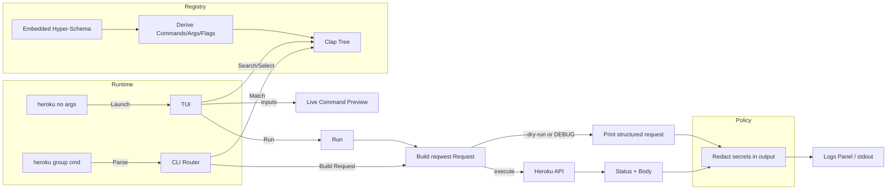

# Heroku CLI (Rust, Experimental)

A schema-driven Heroku CLI with both non-interactive and interactive TUI modes. Commands, arguments, and flags are derived at runtime from the embedded Heroku JSON Hyper-Schema.

## Features
- Dynamic command registry from embedded Hyper-Schema (no static command tables).
- CLI and TUI supported:
  - CLI: derive Clap tree; build requests; `--dry-run` prints structured request.
  - TUI: modern dark theme, search + auto-scrolling command list, inputs with validation, enum cycling, boolean toggles, live Command preview, logs.
- Auth precedence: `HEROKU_API_KEY` > `~/.netrc` (basic parser).
- Redaction: Authorization and secret-like values are masked in output.

## Usage
- Build: `cd heroku && cargo build --workspace`
- Run TUI (no args): `cd heroku && cargo run -p heroku-cli`
- CLI dry-run examples:
  - `cargo run -p heroku-cli -- apps list --dry-run`
  - `cargo run -p heroku-cli -- apps info my-app --dry-run`
  - `cargo run -p heroku-cli -- apps create --name demo --dry-run`
  - `cargo run -p heroku-cli -- releases list my-app --dry-run`
- Live calls: `export HEROKU_API_KEY=...` then run without `--dry-run`.

### TUI Controls
- Search: type to filter (Esc clears); cursor indicates where typing goes.
- Commands: Up/Down selects; auto-scroll keeps selection visible; Enter focuses Inputs.
- Inputs: required args first, then flags; cursor and subtle highlight mark the active field.
  - Booleans: Space toggles [ ]/[x].
  - Enums: Left/Right cycles allowed values; defaults applied from schema.
  - Global Dry-run toggle: only shown when `DEBUG` is set; select last row and press Space.
- Run: Enter; Help: Ctrl+H; Tab/Shift-Tab cycles focus; Quit: Ctrl+C.
  - Copy command to clipboard: Ctrl+Y.

## Architecture
- Registry (schema → commands): parses Hyper-Schema links and derives unique command names from path context (e.g., `apps:list`, `users:apps:list`). Extracts positional args, flags, enums, and defaults.
- CLI: loads registry and builds Clap tree; parses inputs; builds and sends requests (or `--dry-run`).
- TUI: Ratatui + Crossterm; state (app.rs), rendering (ui.rs), CLI preview (preview.rs), theme (theme.rs).
- API: minimal reqwest client with headers, timeouts, and auth precedence.
- Util: redaction helpers.

## Environment
- `HEROKU_API_KEY`: Bearer token for Heroku API (preferred over `~/.netrc`).
- `DEBUG`: when truthy (non-empty, not `0`/`false`), TUI exposes a Dry-run checkbox.
- `RUST_LOG`: set to `info`/`debug` to see logs.

## Development
- Workspace: `cli`, `tui`, `registry`, `engine` (placeholder), `api`, `util`, `xtask`.
- Build all: `cd heroku && cargo build --workspace`
- Test all: `cargo test --workspace`
- Lint: `cargo clippy --workspace -- -D warnings`
- Format: `cargo fmt --all`
- Optional codegen (for inspection only): `cargo run -p xtask -- codegen --schema ../../heroku-schema.json`

## Flow

## Security
- Secrets are redacted from output by default (headers/payload in dry-run output and logs).
- Network calls go through reqwest with default timeouts.

## Status
- Schema-driven registry, CLI router, and TUI are implemented. Engine (workflows) is a placeholder. Some HTTP client behaviors (retries/backoff) are minimal.
