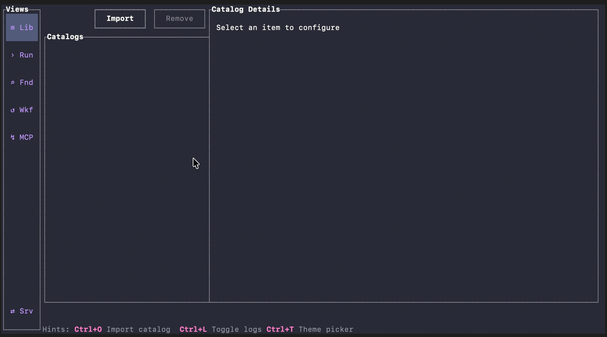

[](https://github.com/oattyio/oatty/actions/workflows/ci.yml)


# Oatty

Schema-driven API operations across CLI, TUI, MCP, and workflows.

Full documentation: https://oatty.io

- Quick Start: https://oatty.io/docs/quick-start
- Learn: https://oatty.io/docs/learn/getting-oriented
- Guides: https://oatty.io/docs/guides/sentry-bootstrap



## What Oatty Does

- Imports OpenAPI schemas and turns them into runnable commands.
- Provides a keyboard-first TUI for discovery, inspection, and execution.
- Exposes commands and workflows through MCP for connected agents.
- Support for thousands of commands without context window saturation.
- Supports reusable, reviewable workflows for cross-system operations.
- Multiple themes and colors in a beautiful TUI.

## Install

### npm (recommended)

```bash
npm i -g oatty
oatty --help
```

### from source

```bash
cargo build --workspace
cargo run -p oatty -- --help
```

## 60-Second Quick Start

1. Launch TUI:

```bash
oatty
```

2. Import an OpenAPI catalog in Library (local file or URL).
3. Search commands in Run Command / Find.
4. Execute commands manually or with Workflows.
5. Use Workflows view to review and run multi-step operations.

For full walkthroughs: https://oatty.io/docs/quick-start

## CLI Basics

```bash
# Run TUI
oatty

# Run a command
oatty <group> <command> [flags]

# Import a catalog
oatty import <path-or-url>

# Workflow commands
oatty workflow list
oatty workflow preview --file workflows/example.yaml
```

## MCP and Agent Usage

Run Oatty as an MCP server so agents can discover and run tools/workflows with explicit operator control.

- MCP HTTP Server docs: https://oatty.io/docs/learn/mcp-http-server
- Safety model: https://oatty.io/docs/learn/how-oatty-executes-safely

## Development

```bash
cargo fmt --all
cargo clippy --workspace -- -D warnings
cargo test --workspace
```

Architecture overview: [ARCHITECTURE.md](ARCHITECTURE.md)
Contributing guide: [CONTRIBUTING.md](CONTRIBUTING.md)
Release process: [RELEASE.md](RELEASE.md)

## License

Dual-licensed under MIT OR Apache-2.0.
