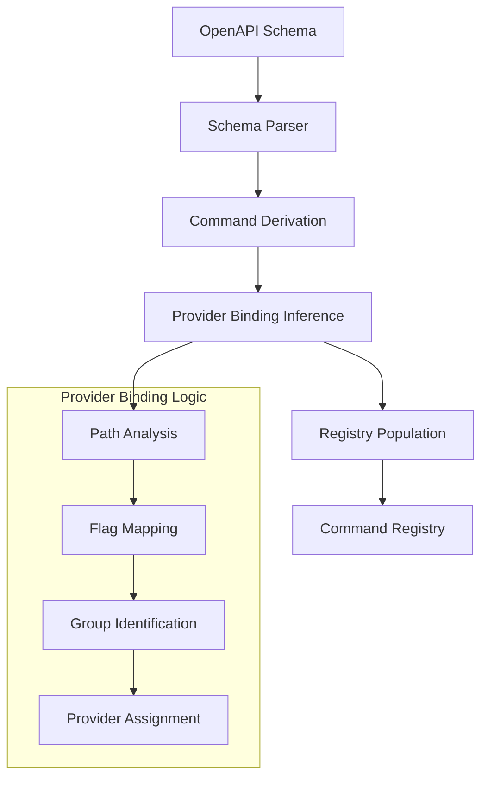
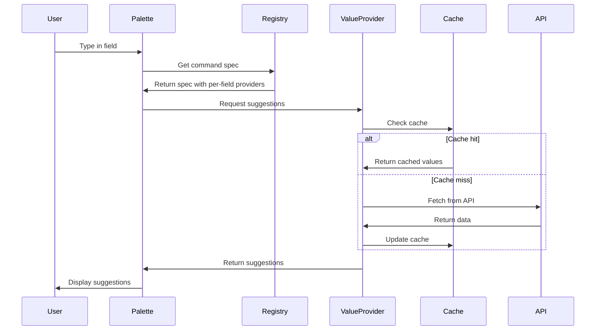
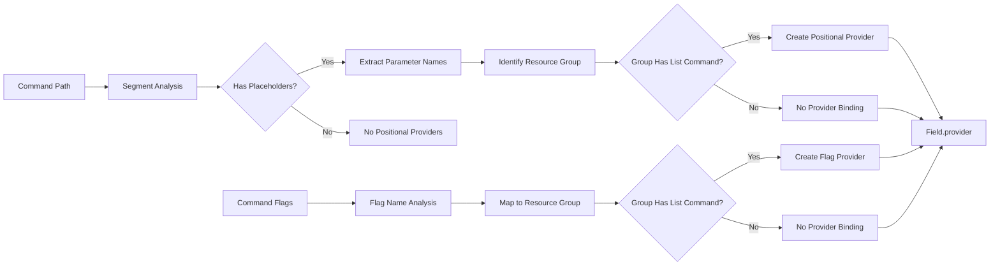

# Value Provider Registry Architecture

## Overview

The Value Provider Registry is a sophisticated system that enables dynamic, context-aware suggestions for Heroku CLI commands. It bridges the gap between static command definitions and dynamic runtime data by providing intelligent autocomplete suggestions for flags, positional arguments, and command values.

## Purpose

The Value Provider Registry serves several key purposes:

1. **Dynamic Autocomplete**: Provides real-time suggestions based on actual Heroku API data
2. **Context Awareness**: Understands command relationships and suggests relevant values
3. **Intelligent Binding**: Automatically maps command parameters to appropriate data sources
4. **Performance Optimization**: Implements caching and background fetching to maintain responsiveness
5. **User Experience Enhancement**: Reduces typing and prevents errors in command construction

## Core Components

### 1. Schema-Driven Provider Resolution (two-pass)

The generator infers and verifies providers in a second pass and embeds them directly on fields (`CommandFlag.provider` and `PositionalArgument.provider`).

#### Key Functions

- Build command index: `<group>:<name>` for all commands
- Identify list-capable groups (presence of `<group>:list`)
- Resolve providers:
  - Positionals: previous concrete path segment → `<group>:list` when present
  - Flags: map flag name to plural group via synonym/pluralization → `<group>:list` when present

#### Provider Resolution Logic

```rust
pub fn resolve_and_infer_providers(commands: &mut [CommandSpec]) {
    let index = build_command_index(commands);
    let list_groups = groups_with_list(&index);
    for spec in commands.iter_mut() {
        // Flags
        apply_flag_providers(&mut spec.flags, &list_groups, &index);
        // Positionals
        apply_positional_providers(&mut spec.positional_args, &spec.path, &list_groups, &index);
    }
}
```

### 2. Registry-Backed Provider (`providers/mod.rs`)

The `RegistryBackedProvider` implements the actual value fetching and caching logic.

#### Architecture Features

- **Asynchronous Fetching**: Background API calls to prevent UI blocking
- **Intelligent Caching**: TTL-based caching with deduplication
- **Concurrent Request Management**: Prevents duplicate API calls for the same provider
- **Fuzzy Matching**: Provides scored suggestions based on partial input

#### Core Implementation

```rust
pub struct RegistryBackedProvider {
    registry: Arc<Registry>,
    ttl: Duration,
    cache: Arc<Mutex<HashMap<String, CacheEntry>>>,
    active_fetches: Arc<Mutex<HashSet<String>>>,
}

impl ValueProvider for RegistryBackedProvider {
    fn suggest(&self, command_key: &str, field: &str, partial: &str) -> Vec<SuggestionItem> {
        let (group, name) = command_key.split_once(':').unwrap_or(("", ""));
        let provider_id = self.provider_for_field(group, name, field)?;
        let values = self.list_values_for_provider(&provider_id);
        
        // Apply fuzzy matching and scoring
        values.into_iter()
            .filter_map(|value| {
                fuzzy_score(&value, partial).map(|score| SuggestionItem {
                    display: value.clone(),
                    insert_text: value,
                    kind: ItemKind::Value,
                    meta: Some(provider_id.clone()),
                    score,
                })
            })
            .collect()
    }
}
```

### 3. Palette Integration (`palette.rs`)

The command palette component integrates the provider system with the user interface.

#### Key Features

- **Real-time Suggestions**: Updates suggestions as users type
- **Contextual Help**: Integrates with help system for command guidance
- **Smart Navigation**: Handles suggestion selection and command completion
- **Error Handling**: Displays validation errors and provider status

#### Suggestion Flow

```rust
fn handle_tab_press(&self, app: &mut app::App) {
    let SharedCtx { registry, providers, .. } = &app.ctx;
    app.palette.apply_build_suggestions(registry, providers);
    app.palette.set_is_suggestions_open(app.palette.suggestions_len() > 0);
}
```

## Data Flow Architecture

### 1. Command Registration Flow



### 2. Runtime Suggestion Flow



### 3. Provider Resolution Heuristics



## Implementation Details

### Provider Attachment Types

Providers are attached directly to fields:

1. **Positional Arguments**: Inferred from URL path parameters and verified
2. **Flag Values**: Inferred via naming conventions and verified

Note: Confidence scoring and a separate providers vector are removed; providers are only attached when verifiably resolvable.

### Caching Strategy

The caching system implements several optimizations:

- **TTL-based Expiration**: Configurable cache lifetime
- **Background Refresh**: Non-blocking API updates
- **Deduplication**: Prevents concurrent fetches for the same provider
- **Memory Efficiency**: Automatic cleanup of expired entries

### Error Handling

The system gracefully handles various failure scenarios:

- **API Failures**: Falls back to cached data or empty suggestions
- **Network Issues**: Continues operation with existing cache
- **Schema Errors**: Logs issues without breaking the UI
- **Provider Mismatches**: Graceful degradation to basic autocomplete

## Usage Examples

### 1. Basic Provider Usage

```rust
// Create a provider with 60-second cache TTL
let provider = RegistryBackedProvider::new(
    Arc::new(registry), 
    Duration::from_secs(60)
);

// Get suggestions for an app field
let suggestions = provider.suggest("config:update", "app", "my");
// Returns: ["my-app-1", "my-app-2", "my-app-production"]
```

### 2. Custom Provider Integration

```rust
// Implement custom ValueProvider trait
impl ValueProvider for CustomProvider {
    fn suggest(&self, command_key: &str, field: &str, partial: &str) -> Vec<SuggestionItem> {
        // Custom suggestion logic
        vec![]
    }
}

// Register with the system
let providers = vec![
    Box::new(RegistryBackedProvider::new(registry, ttl)),
    Box::new(CustomProvider::new()),
];
```

### 3. Schema-Driven Binding

```yaml
# OpenAPI schema automatically generates bindings
paths:
  /apps/{app}/config:
    get:
      parameters:
        - name: app
          in: path
          required: true
          schema:
            type: string
      # Automatically infers: app parameter → apps:list provider
```

## Performance Considerations

### Optimization Strategies

1. **Lazy Loading**: Providers only fetch data when needed
2. **Background Processing**: API calls don't block the UI
3. **Smart Caching**: TTL-based expiration with background refresh
4. **Request Deduplication**: Prevents redundant API calls
5. **Fuzzy Matching**: Efficient suggestion filtering

### Memory Management

- **Cache Size Limits**: Configurable maximum cache entries
- **Automatic Cleanup**: Expired entries are removed
- **Arc-based Sharing**: Efficient memory sharing across components
- **Lazy Initialization**: Providers are created on-demand

## Security Considerations

### Data Protection

- **API Key Management**: Secure handling of Heroku API credentials
- **Request Validation**: Input sanitization and validation
- **Rate Limiting**: Respects API rate limits
- **Error Masking**: Sensitive information is not exposed in logs

### Access Control

- **Provider Isolation**: Each provider operates independently
- **Permission Checking**: Respects user's Heroku account permissions
- **Audit Logging**: Tracks provider usage for debugging

## Testing Strategy

### Unit Tests

- **Provider Logic**: Individual provider behavior testing
- **Binding Inference**: Schema parsing and provider assignment
- **Cache Operations**: Cache hit/miss scenarios
- **Error Handling**: Various failure modes

### Integration Tests

- **End-to-End Flows**: Complete suggestion workflows
- **API Integration**: Real Heroku API interactions
- **Performance Testing**: Cache efficiency and response times
- **Concurrency Testing**: Multiple simultaneous requests

### Test Data

```rust
#[test]
fn test_provider_binding_inference() {
    let json = r#"{
        "links": [
            { "href": "/apps", "method": "GET", "title": "List apps" },
            { "href": "/apps/{app}/config", "method": "PATCH", "title": "Update config" }
        ]
    }"#;
    
    let commands = derive_commands_from_schema(&json).unwrap();
    let config_cmd = commands.iter().find(|c| c.path.contains("config")).unwrap();
    
    assert!(config_cmd.providers.iter().any(|p| 
        p.name == "app" && p.provider_id == "apps:list"
    ));
}
```

## Future Enhancements

### Planned Features

1. **Multi-Provider Support**: Combine suggestions from multiple sources
2. **Context-Aware Suggestions**: Consider command history and user preferences
3. **Intelligent Ranking**: Machine learning-based suggestion ordering
4. **Offline Mode**: Local caching for offline operation
5. **Provider Plugins**: Extensible provider system for third-party integrations

### Scalability Improvements

1. **Distributed Caching**: Redis-based shared cache
2. **Provider Load Balancing**: Multiple provider instances
3. **Async Streaming**: Real-time suggestion updates
4. **Batch Processing**: Efficient bulk data fetching

## Conclusion

The Value Provider Registry represents a sophisticated approach to command-line autocomplete that goes beyond simple text matching. By combining schema analysis, intelligent binding inference, and efficient caching, it provides a seamless user experience while maintaining performance and reliability.

The architecture's modular design allows for easy extension and customization, making it suitable for both current needs and future enhancements. The integration with the command palette creates a cohesive user experience that significantly improves CLI usability.
