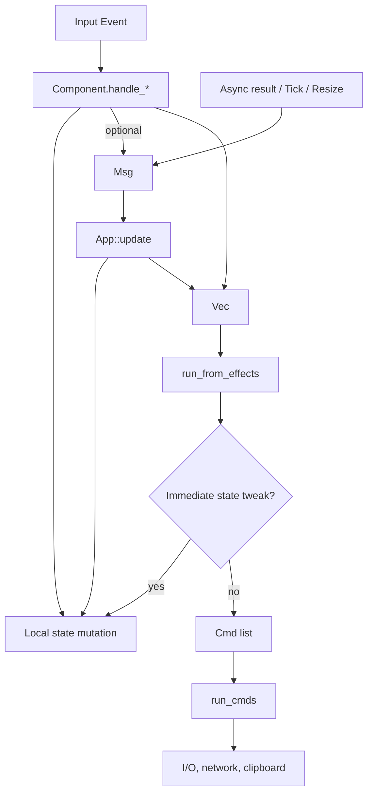

# Message, Effect, and Command Architecture

This document explains how the Heroku TUI routes user input, state changes, and
side effects. The application is **TEA-inspired**: it keeps a single `App`
model, distinguishes between incoming messages and outgoing effects, and runs
side effects through a command runner. At the same time, it makes a few
pragmatic deviations to keep component code ergonomic for a terminal UI. This
page documents the intended patterns—including the exceptions—so future work can
stay consistent.

## High-Level Flow



Key ideas:

- **Local-first updates**: Components mutate the portion of `App` they own
  directly (e.g., palette input buffers, table scroll offsets). Messages are
  reserved for cross-component coordination or returning async results.
- **Effects carry intents**: Components and `App::update` return `Vec<Effect>` for
  actions that need to reach the runtime (clipboard writes, plugin lifecycle,
  modal routing).
- **Command runner**: `run_from_effects` converts effects into `Cmd`s and
  executes them via `run_cmds`. Some effects short-circuit to local state updates
  instead of producing commands—these intentional shortcuts are documented
  below.

## Messages (`Msg`)

Messages represent inbound events: timers, async completions, or user actions
that must be visible outside the current component. They are handled in
`App::update` and may return `Vec<Effect>`.

```rust
#[derive(Debug, Clone)]
pub enum Msg {
    Run,
    CopyToClipboard(String),
    Tick,
    Resize(u16, u16),
    ExecCompleted(Box<ExecOutcome>),
    LogsUp,
    LogsDown,
    LogsExtendUp,
    LogsExtendDown,
    LogsOpenDetail,
    LogsCloseDetail,
    LogsCopy,
    LogsTogglePretty,
}
```

**Usage guidelines**

- Prefer direct state mutation inside components when the change is local and
  synchronous.
- Emit a `Msg` when
  - an async boundary will send a response later (`ExecCompleted`),
  - multiple features must react to the same event (e.g., `Tick`), or
  - a component needs `App`-level logic that returns additional effects (such as
    `CopyToClipboard`).
- `App::update` may call helpers that trigger commands immediately (see
  [Palette execution](#palette-execution) for the notable exception).

## Effects (`Effect`)

Effects describe outgoing actions the runtime should perform. Most effects map
1:1 to a command, but some also mutate UI state synchronously before (or instead
of) producing `Cmd`s: `ShowModal`, `CloseModal`, and `SwitchTo` update the model
without enqueuing additional work.

```rust
#[derive(Debug, Clone, PartialEq, Eq)]
pub enum Effect {
    CopyToClipboardRequested(String),
    CopyLogsRequested(String),
    NextPageRequested(String),
    PrevPageRequested,
    FirstPageRequested,
    LastPageRequested,
    PluginsLoadRequested,
    PluginsRefresh,
    PluginsStart(String),
    PluginsStop(String),
    PluginsRestart(String),
    PluginsOpenLogs(String),
    PluginsRefreshLogs(String),
    PluginsExportLogsDefault(String),
    PluginsOpenSecrets(String),
    PluginsSaveEnv { name: String, rows: Vec<(String, String)> },
    PluginsOpenAdd,
    PluginsValidateAdd,
    PluginsApplyAdd,
    PluginsCancel,
    SwitchTo(Route),
    ShowModal(Modal),
    CloseModal,
}
```

**Guidelines**

- Return effects for clipboard access, plugin lifecycle, pagination fetches, and
  modal routing.
- Keep vectors short—most key handlers return zero or one effect per event.
- When new effects mutate `App` immediately, document that behavior next to the
  handler to keep expectations clear.

## Commands (`Cmd`)

Commands execute the imperative work. They live in `crates/tui/src/cmd.rs` and
are the only place that performs I/O, network calls, or filesystem access.

```rust
#[derive(Debug)]
pub enum Cmd {
    ClipboardSet(String),
    ExecuteHttp(Box<CommandSpec>, Map<String, Value>),
    LoadPlugins,
    PluginsStart(String),
    PluginsStop(String),
    PluginsRestart(String),
    PluginsRefresh,
    PluginsRefreshLogs(String),
    PluginsExportLogsDefault(String),
    PluginsOpenSecrets(String),
    PluginsSaveEnv { name: String, rows: Vec<(String, String)> },
    PluginsValidateAdd,
    PluginsApplyAdd,
    PluginsCancel,
}
```

### `run_from_effects`

- Iterates through each effect.
- Applies any immediate state transitions (`ShowModal`, `CloseModal`,
  `SwitchTo`).
- Converts the remaining effects into zero or more `Cmd`s.
- Passes the command list to `run_cmds`, which returns a `CommandBatch` with
  immediate `ExecOutcome`s plus any spawned `JoinHandle<ExecOutcome>` for
  long-running work.
- The runtime owns a `FuturesUnordered` queue of those pending handles and
  polls them alongside input/tick events so animations keep updating while
  commands execute.

Because modal routing mutates the app inside `run_from_effects`, the doc strings
for these effects should note that they do not produce commands.

## Intentional Deviations

### Palette execution

`Msg::Run` delegates to `start_palette_execution`, which ultimately calls
`run_cmds` directly instead of returning an `Effect`. This keeps the validation
logic and HTTP kick-off in one place. The helper still records pagination
context on `App` before triggering the command runner. When documenting new
features, call out similar direct-command helpers so maintainers know where to
look for side effects.

### Local state mutation

Handlers such as `PaletteComponent::handle_key_events`, `LogsComponent::handle_key_events`,
and `PluginsSearchComponent::handle_key_events` mutate `app.palette`, `app.logs`,
and `app.plugins` respectively without emitting messages. This is the standard
pattern for focused UI components. Use `Msg` or `Effect` only when state outside
the component’s slice must change or when you need to trigger I/O.

### Synchronous effects

`Effect::ShowModal`, `Effect::CloseModal`, and `Effect::SwitchTo` tweak the global
view immediately and return no commands. They still travel through
`run_from_effects` so that routing logic stays centralized. Any new synchronous
effects should follow this pattern: mutate state in the translator, return
`None`, and document the behavior.

### Plugins coordinator shortcuts

`PluginsComponent::handle_control_shortcuts` can emit multiple plugin-related
effects (start, stop, open logs, etc.). The handler now propagates its collected
effects so they reach the runtime. When adding new shortcuts, push the
appropriate effect into the vector and return it; the runtime will batch the
commands.

## Practical Checklist

When adding or updating behavior:

1. **Component event**: Mutate local state directly. Emit `Effect`s only for
   cross-feature work or I/O.
2. **Message handling**: Use `Msg` when multiple features must respond or when an
   async result arrives.
3. **Effect translation**: Update `run_from_effects` if the effect needs special
   handling or spawns new commands.
4. **Command execution**: Keep side-effectful code in `cmd.rs` helpers. Log
   outcomes and maintain pagination or plugin state as needed.
5. **Documentation**: Note any synchronous state changes performed during effect
   translation so the architecture remains predictable.

By documenting both the TEA-inspired structure and the intentional deviations,
this guide should match the current implementation and clarify where new code
fits within the architecture.
